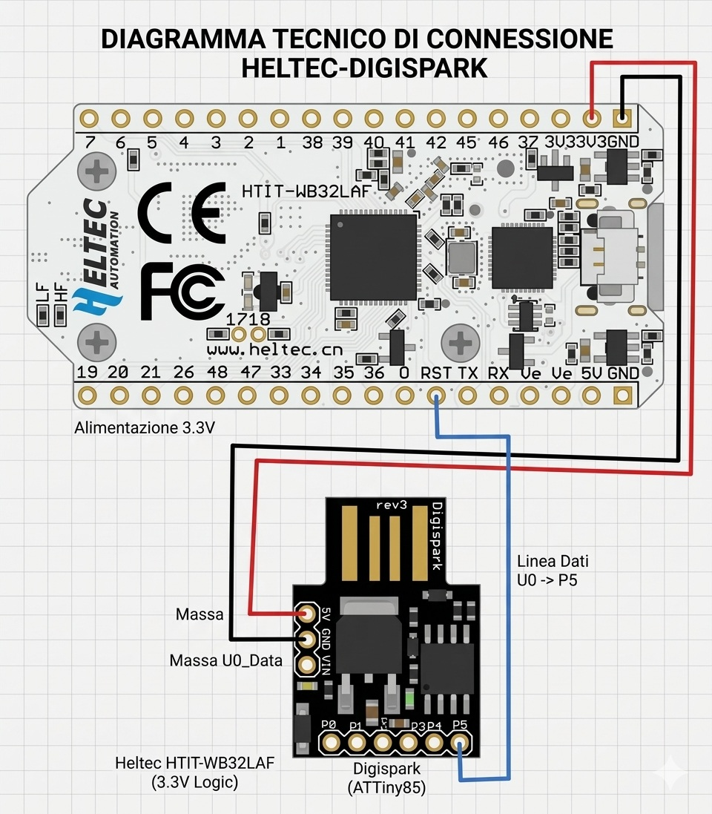

# esp32-auto-reset-digispar
External auto-reset system for ESP32 using a Digispark ATtiny85 (Heltec V3 compatible).

# ESP32 Auto-Reset con Digispark ATtiny85

Questo progetto implementa un sistema di **reset automatico periodico** per un ESP32 (Heltec WiFi Kit 32)
controllato da un Digispark ATtiny85, senza modifiche al firmware dell'ESP32 e senza componenti extra.

## Descrizione

Il Digispark ATtiny85 abbassa periodicamente il pin `RST` dell'ESP32 a GND per circa 300ms,
causando un hard reset del microcontroller. Il ciclo di reset avviene ogni 12 ore (modificabile).
Il Digispark è alimentato direttamente dall'ESP32 tramite il pin 3V3.

## Schema di collegamento



## Specifiche hardware

| Componente | Modello |
|---|---|
| Microcontroller principale | Heltec WiFi Kit 32 (ESP32) |
| Controller reset | Digispark ATtiny85 USB |

## Collegamento pin

| Filo | Da | A | Note |
|------|-----|---|------|
| 🔴 Alimentazione | Heltec **3V3** | Digispark **5V** | Bypassa il regolatore interno |
| ⚫ Massa | Heltec **GND** | Digispark **GND** | Massa comune obbligatoria |
| 🔵 Segnale reset | Digispark **P5** | Heltec **RST** | Impulso LOW per 300ms |

> ⚠️ **Importante**: collegare 3V3 al pin `5V` del Digispark (NON a `VIN`).
> Il pin VIN è pensato per tensioni 7-35V e non funziona correttamente con 3.3V.

## Come funziona

1. Il Digispark si avvia e attende 12 ore
2. Porta P5 in `OUTPUT LOW` → il pin RST dell'ESP32 va a GND → **reset**
3. Dopo 300ms porta P5 in `INPUT` (alta impedenza) → il pull-up interno riporta RST a 3.3V → **ESP32 riparte**
4. Il ciclo si ripete ogni 12 ore

## Codice ATtiny85 (Digispark)

```cpp
#define RST_PIN 5  // P5 = PB5 su Digispark
#define LED_PIN 1

void setup() {
  pinMode(LED_PIN, OUTPUT);
  pinMode(RST_PIN, INPUT);   // Alta impedenza, non disturba RST
  digitalWrite(LED_PIN, LOW);
}

void loop() {
  // Esegui reset
  pinMode(RST_PIN, OUTPUT);
  digitalWrite(RST_PIN, LOW);   // Porta RST a GND → reset ESP32
  digitalWrite(LED_PIN, HIGH);  // LED acceso durante reset
  delay(300);                   // 300ms sufficienti

  // Rilascia
  pinMode(RST_PIN, INPUT);      // Alta impedenza → RST risale grazie al pull-up
  digitalWrite(LED_PIN, LOW);

  delay(43200000); // 12 ore (modifica a piacere)
}
```

## Note

- Il `delay(43200000)` corrisponde a **12 ore** in millisecondi
- Il valore massimo di `unsigned long` su ATtiny85 è ~49.7 giorni, quindi è sicuro
- Per reset ogni ora usa `delay(3600000)`
- Per reset ogni 24 ore usa `delay(86400000)`

## Licenza

MIT License
